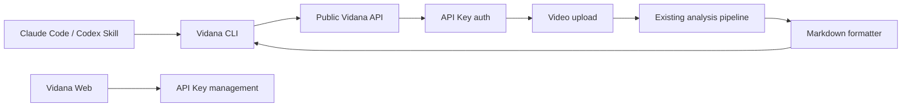

# Vidana CLI and Agent Skill Design

## Goal

Add a CLI path for Vidana so users can run video analysis from their own terminal or from an agent environment such as Claude Code. The Web UI remains the primary interactive experience. The CLI is a thin client for the hosted Vidana service and returns a Markdown report by default.

## Product Scope

First release includes:

- Hosted-service CLI analysis through an API key.
- One command: `vidana analyze`.
- Markdown output to stdout.
- A Web documentation page that explains setup and usage.
- A reusable agent skill template named `vidana-video-analysis`.

First release excludes:

- Local direct Mimo or Supabase configuration.
- Cookie-based CLI authentication.
- Browser OAuth login from the CLI.
- A public JavaScript SDK package.
- Multi-command project management features.

## User Flow

1. User opens Vidana Web and signs in.
2. User creates or copies a Vidana API key from the Web app.
3. User installs the CLI.
4. User sets `VIDANA_API_KEY`.
5. User runs:

```bash
vidana analyze ./demo.mp4 \
  --audience "二三线城市 30-50 岁男性" \
  --platform "抖音" \
  --context "集成空调投放素材"
```

6. CLI uploads the video to the hosted Vidana API, waits for analysis, and prints Markdown.
7. User can redirect output to a file:

```bash
vidana analyze ./demo.mp4 --audience "二三线城市 30-50 岁男性" --platform "抖音" > report.md
```

## Architecture



## Public API

Add API-key authenticated endpoints under `/api/public`.

### `POST /api/public/analyze`

Request:

- Authentication: `Authorization: Bearer <VIDANA_API_KEY>`
- Body: multipart form data
  - `video`: video file
  - `targetAudience`: required
  - `platform`: required
  - `context`: optional

Response:

```json
{
  "analysisId": "uuid",
  "markdown": "# Vidana 视频分析报告\n\n## 基本信息\n\n- 目标用户：二三线城市 30-50 岁男性\n- 投放平台：抖音\n- 效果评分：72/100\n",
  "report": {
    "score": 72,
    "summary": "视频卖点明确，但开场节奏和人物表达偏硬，需要提升生活感和信任感。",
    "timelineEdits": [],
    "globalEdits": [],
    "suggestions": []
  }
}
```

The endpoint should reuse the existing analysis pipeline where practical. It must not mark an empty Mimo response as completed. Empty model output is a failed analysis with a clear error.

## API Key Model

Add a new `api_keys` table:

| Field | Type | Notes |
| --- | --- | --- |
| id | uuid | Primary key |
| user_id | uuid | Owner |
| name | text | User-visible label |
| key_hash | text | Hashed secret, never store raw key |
| prefix | text | Short display prefix |
| last_used_at | timestamptz | Nullable |
| revoked_at | timestamptz | Nullable |
| created_at | timestamptz | Created time |

Generated keys should use a recognizable prefix such as `vdn_`. The raw token is shown only once when created.

## CLI

Package target:

- Node-based CLI in this repo.
- Command name: `vidana`.
- Authentication: `VIDANA_API_KEY`.
- Service URL: default hosted Vidana URL, override with `VIDANA_API_BASE_URL` for development.

Initial command:

```bash
vidana analyze <video-path> \
  --audience <target audience> \
  --platform <platform> \
  --context <background>
```

Behavior:

- Validates file exists before upload.
- Validates required `--audience` and `--platform`.
- Sends multipart request to `/api/public/analyze`.
- Prints Markdown to stdout.
- Prints errors to stderr with direct recovery guidance.
- Exits `0` on success and non-zero on failure.

## Markdown Report Format

Default CLI output:

```markdown
# Vidana 视频分析报告

## 基本信息

- 目标用户：二三线城市 30-50 岁男性
- 投放平台：抖音
- 效果评分：72/100

## 综合判断

视频卖点明确，但开场节奏和人物表达偏硬，需要提升生活感和信任感。

## 逐场景修改

| 时间点 | 优先级 | 类型 | 问题 | 修改动作 |
| --- | --- | --- | --- | --- |

## 全局修改

- 降低叫卖式表达，改成更接近真实居家场景的表达方式。

## 宏观建议

- 开头 3 秒优先展示用户痛点，再进入产品解决方案。
```

The Markdown should be stable enough for agents to parse and pleasant enough for humans to read.

## Agent Skill

Create a `vidana-video-analysis` skill template. It should tell an agent:

- Use Vidana when the user asks to review, diagnose, or improve a video for a target audience or platform.
- Check that `vidana` is installed.
- Check that `VIDANA_API_KEY` is set.
- Ask only for missing essentials: video path, target audience, platform.
- Run `vidana analyze`.
- Use the Markdown report as source material for follow-up editing plans, shooting advice, or ad optimization notes.

The skill must not invent analysis if the CLI fails. It should surface the concrete CLI error.

## Documentation Page

Add a Web page for CLI usage, reachable from the main app header or a clear docs link.

Content sections:

1. What the CLI is for.
2. Generate an API key.
3. Install the CLI.
4. Run your first analysis.
5. Use Vidana inside Claude Code or another agent.
6. Troubleshooting.

The page should feel like product documentation, not a marketing landing page. It should include copy-pasteable commands and one realistic Chinese example.

## Error Handling

CLI errors should be direct:

- Missing API key: tell the user to set `VIDANA_API_KEY`.
- Invalid API key: tell the user to regenerate a key in Vidana Web.
- Missing file: show the provided path.
- Video upload failed: show API message.
- Mimo returned no content: report that the model returned no analysis content and suggest retrying with a shorter or smaller video.
- Network failure: suggest checking `VIDANA_API_BASE_URL` or internet access.

## Testing

Add focused tests for:

- API key hashing and verification.
- Markdown formatting from a normalized report.
- CLI argument validation.
- Public API rejects missing or invalid API key.
- Public API returns Markdown for a mocked completed analysis.

Manual verification:

- Run CLI against local development API.
- Save Markdown output to a file.
- Confirm the Web UI still works for the existing upload-and-analyze flow.

## Open Decisions

The first version intentionally chooses hosted-service CLI, API-key authentication, and Markdown-only default output. JSON output can be added later if users need pipeline integration.
